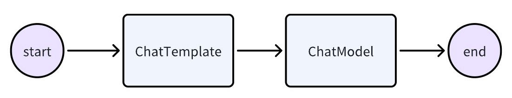
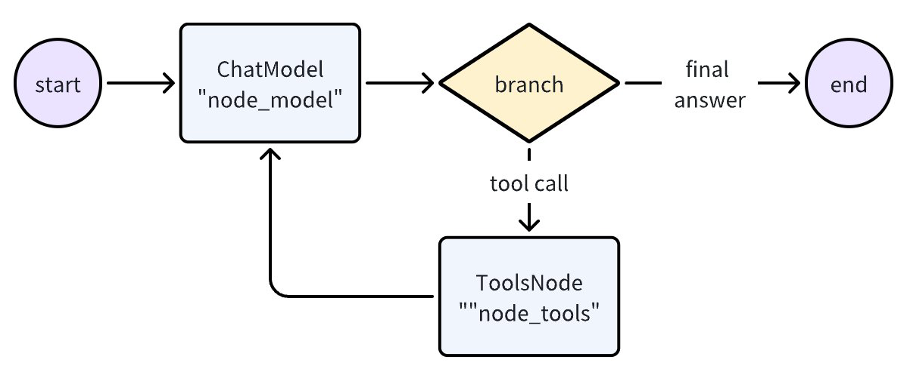
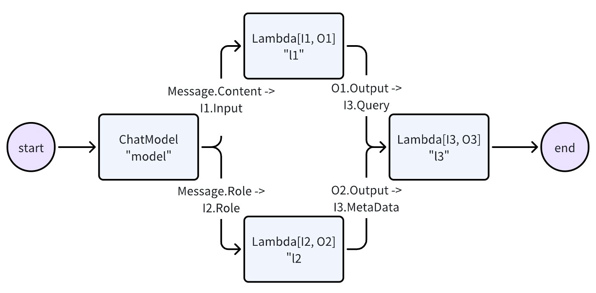
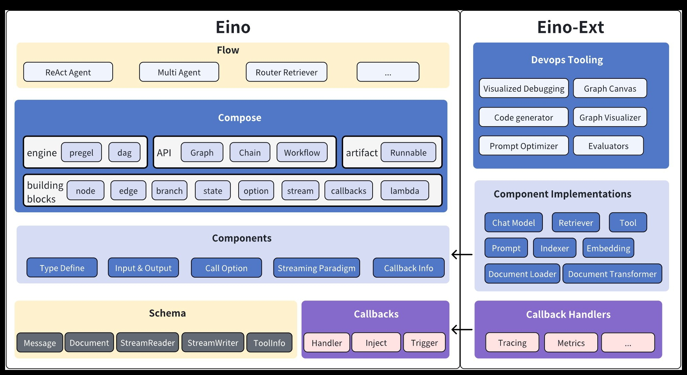
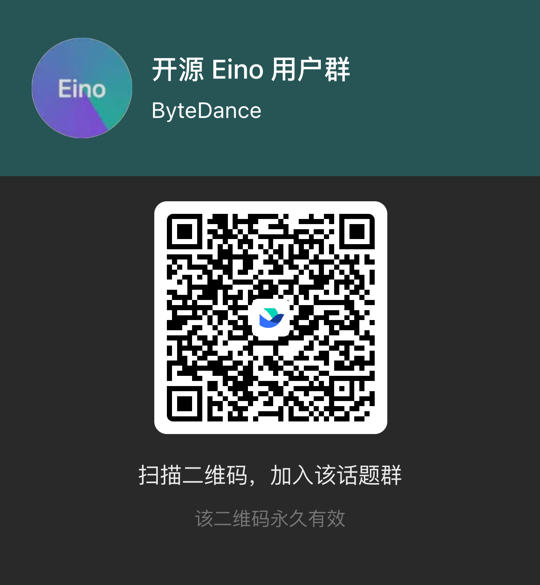

# Eino


[](https://github.com/cloudwego/eino/releases)
[](https://www.cloudwego.io/)
[](https://github.com/cloudwego/eino/blob/main/LICENSE)
[](https://goreportcard.com/report/github.com/cloudwego/eino)
[](https://github.com/cloudwego/kitex/eino)
[](https://github.com/cloudwego/eino/issues?q=is%3Aissue+is%3Aclosed)


English | [中文](README.zh_CN.md)

# Overview

**Eino['aino]** (pronounced similarly to "I know") aims to be the ultimate LLM application development framework in Golang. Drawing inspirations from many excellent LLM application development frameworks in the open-source community such as LangChain & LlamaIndex, etc., as well as learning from cutting-edge research and real world applications, Eino offers an LLM application development framework that emphasizes on simplicity, scalability, reliability and effectiveness that better aligns with Golang programming conventions.

What Eino provides are:
- a carefully curated list of **component** abstractions and implementations that can be easily reused and combined to build LLM applications
- a powerful **composition** framework that does the heavy lifting of strong type checking, stream processing, concurrency management, aspect injection, option assignment, etc. for the user.
- a set of meticulously designed **API** that obsesses on simplicity and clarity.
- an ever-growing collection of best practices in the form of bundled **flows** and **examples**.
- a useful set of tools that covers the entire development cycle, from visualized development and debugging to online tracing and evaluation.

With the above arsenal, Eino can standardize, simplify, and improve efficiency at different stages of the AI application development cycle:


# A quick walkthrough

Use a component directly:
```Go
model, _ := openai.NewChatModel(ctx, config) // create an invokable LLM instance
message, _ := model.Generate(ctx, []*Message{
    SystemMessage("you are a helpful assistant."),
    UserMessage("what does the future AI App look like?")}
```

Of course, you can do that, Eino provides lots of useful components to use out of the box. But you can do more by using orchestration, for three reasons:
- orchestration encapsulates common patterns of LLM application.
- orchestration solves the difficult problem of processing stream response by the LLM.
- orchestration handles type safety, concurrency management, aspect injection and option assignment for you.

Eino provides three set of APIs for orchestration

| API      | Characteristics and usage                                       |
| -------- | --------------------------------------------------------------- |
| Chain    | Simple chained directed graph that can only go forward.         |
| Graph    | Cyclic or Acyclic directed graph. Powerful and flexible.        |
| Workflow | Acyclic graph that supports data mapping at struct field level. |

Let's create a simple chain: a ChatTemplate followed by a ChatModel.



```Go
chain, _ := NewChain[map[string]any, *Message]().
           AppendChatTemplate(prompt).
           AppendChatModel(model).
           Compile(ctx)
chain.Invoke(ctx, map[string]any{"query": "what's your name?"})
```

Now let's create a graph that uses a ChatModel to generate tool calls, then uses a ToolsNode to execute those tools, then feed the tool response back to ChatModel.



```Go
graph := NewGraph[[]*Message, *Message]()
graph.AddChatModelNode("node_model", model)
graph.AddToolsNode("node_tools", toolsNode)
graph.AddEdge(START, "node_model")
graph.AddEdge("node_tools", "node_model")
graph.AddBranch("node_model", branch)
runnable, _ := graph.Compile(ctx)
runnable.Stream(ctx, []*Message{UserMessage("help me plan my weekend")})
```

Now let's create a workflow that flexibly maps input & output at the field level:



```Go
wf := NewWorkflow[[]*Message, *Message]()
wf.AddChatModelNode("model", model).AddInput(NewMapping(START))
wf.AddLambdaNode("l1", lambda1).AddInput(NewMapping("model").From("Content").To("Input"))
wf.AddLambdaNode("l2", lambda2).AddInput(NewMapping("model").From("Role").To("Role"))
wf.AddLambdaNode("l3", lambda3).AddInput(
    NewMapping("l1").From("Output").To("Query"),
    NewMapping("l2").From("Output").To("MetaData"),
)
wf.AddEnd([]*Mapping{NewMapping("node_l3")}
runnable, _ := wf.Compile(ctx)
runnable.Invoke(ctx, []*Message{UserMessage("kick start this workflow!")})
```

Now let's create a 'ReAct' agent: A ChatModel binds to Tools. It receives input Messages and decides independently whether to call the Tool or output the final result. The execution result of the Tool will again become the input Message for the ChatModel and serve as the context for the next round of independent judgment.

We write this in dozens lines of code:
```Go
// build a ReAct agent that accepts []*Message as input and outputs *Message as output
func (r *Agent) build(ctx context.Context, config *AgentConfig) (
    _ Runnable[[]*Message, *Message], err error) {
    var (
       // the LLM responsible for reasoning and generating output within the ReAct Agent
       chatModel = config.Model
       // the actual executor of tools
       toolsNode *ToolsNode
       // the meta info of tools
       toolInfos []*schema.ToolInfo
       // the graph consist of the ChatModel and ToolsNode
       graph *Graph[[]*Message, *Message]
       // read and write contextual messages before ChatModel execution
       modelPreHandle StatePreHandler[[]*Message, *state]
       // after ChatModel execution, routes to END if output does not contain tool call info, otherwise routes to ToolsNode
       modelPostBranch *GraphBranch
    )

    if toolInfos, err = genToolInfos(ctx, config); err != nil {
       return nil, err
    }

    if err = chatModel.BindTools(toolInfos); err != nil {
       return nil, err
    }

    if toolsNode, err = NewToolNode(ctx, &config.ToolsConfig); err != nil {
       return nil, err
    }

    // creates a graph with state that stores messages across multiple rounds of ReAct loop
    graph = NewGraph[[]*Message, *Message](
       WithGenLocalState(func(ctx context.Context) *state {
          return &state{Messages: make([]*Message, 0, config.MaxStep+1)}
       }))

    modelPreHandle = func(ctx context.Context, input []*Message, state *state) (
       []*Message, error) {
       state.Messages = append(state.Messages, input...)

       modifiedInput := make([]*Message, 0, len(state.Messages))
       copy(modifiedInput, state.Messages)
       return config.MessageModifier(ctx, modifiedInput), nil // add system prompt
    }

    err = graph.AddChatModelNode(nodeKeyModel, chatModel, WithStatePreHandler(modelPreHandle))
    if err != nil {
       return nil, err
    }

    if err = graph.AddEdge(START, nodeKeyModel); err != nil { // chatModel connects to START because it accepts initial input
       return nil, err
    }

    if err = graph.AddToolsNode(nodeKeyTools, toolsNode); err != nil {
       return nil, err
    }

    // chatModel's output can be a stream with multiple chunks of messages
    // we use StreamGraphBranch here to make the routing decision based only on the first chunk 
    modelPostBranch = NewStreamGraphBranch(
       func(_ context.Context, sr *schema.StreamReader[*Message]) (endNode string, err error) {
          defer sr.Close()

          if msg, err := sr.Recv(); err != nil {
             return "", err
          } else if len(msg.ToolCalls) == 0 {
             return END, nil
          }

          return nodeKeyTools, nil
       }, map[string]bool{nodeKeyTools: true, END: true})
    if err = graph.AddBranch(nodeKeyModel, modelPostBranch); err != nil {
       return nil, err
    }

    if err = graph.AddEdge(nodeKeyTools, nodeKeyModel); err != nil { // toolsNode's output are fed back to chatModel
       return nil, err
    }

    // compile Graph to Runnable：do type check、inject callback aspects、automatic stream boxing and unboxing、generate graph runner, etc.
    return graph.Compile(ctx, WithMaxRunSteps(config.MaxStep))
}
```

Eino automatically does important stuff behind the above code:
- Type checking: it makes sure the two nodes' input and output types match at compile time.
- Stream processing: concatenates message stream before passing to chatModel and toolsNode if needed, and copies the stream into callback handlers.
- Concurrency management: the shared state can be safely read and written because the StatePreHandler is concurrency safe.
- Aspect injection: injects callback aspects before and after the execution of ChatModel if the specified ChatModel implementation hasn't injected itself.
- Option assignment: call options are assigned either globally, to specific component type or to specific node.

For example, you could easily extend the compiled graph with callbacks:
```Go
handler := NewHandlerBuilder().
  OnStartFn(
    func(ctx context.Context, info *RunInfo, input CallbackInput) context.Context) {
        log.Infof("onStart, runInfo: %v, input: %v", info, input)
    }).
  OnEndFn(
    func(ctx context.Context, info *RunInfo, output CallbackOutput) context.Context) {
        log.Infof("onEnd, runInfo: %v, out: %v", info, output)
    }).
  Build()
  
compiledGraph.Invoke(ctx, input, WithCallbacks(handler))
```

or you could easily assign options to different nodes:
```Go
// assign to All nodes
compiledGraph.Invoke(ctx, input, WithCallbacks(handler))

// assign only to ChatModel nodes
compiledGraph.Invoke(ctx, input, WithChatModelOption(WithTemperature(0.5))

// assign only to node_1
compiledGraph.Invoke(ctx, input, WithCallbacks(handler).DesignateNode("node_1"))
```

# Key Features

## Rich Components

- Encapsulates common building blocks into **component abstractions**, each have multiple **component implementations** that are ready to be used out of the box.
    - component abstractions such as ChatModel, Tool, PromptTemplate, Retriever, Document Loader, Lambda, etc.
    - each component type has an interface of its own: defined Input & Output Type, defined Option type, and streaming paradigms that make sense.
    - implementations are transparent. Abstractions are all you care about when orchestrating components together.

- Implementations can be nested and captures complex business logic.
    - React Agent, MultiQueryRetriever, Host MultiAgent, etc. They consist of multiple components and non-trivial business logic.
    - They are still transparent from the outside. A MultiQueryRetriever can be used anywhere that accepts a Retriever.

## Powerful Orchestration (Graph/Chain/Workflow)

- Data flows from Retriever / Document Loaders / Prompt Template to ChatModel, then flows to Tools and parsed as Final Answer. This directed, controlled flow of data through multiple components can be implemented through **graph orchestration**.
- Component instances are graph nodes, and edges are data flow channels.
- Graph orchestration is powerful and flexible enough to implement complex business logic:
  - type checking, stream processing, concurrency management, aspect injection and option assignment are handled by the framework.
  - branch out execution at runtime, read and write global state, or do field level data mapping using workflow.

## Complete Stream Processing

- Stream processing is important because ChatModel outputs chunks of messages in real time as it generates them.
- Eino automatically **concatenates** stream chunks for downstream nodes that only accepts non-stream input, such as ToolsNode.
- Eino automatically **boxes** non stream into stream when stream is needed during graph execution.  
- Eino automatically **merges** multiple streams as they converge into a single downward node.
- Eino automatically **copies** stream as they fan out to different downward node, or is passed to callback handlers.
- most importantly, Eino automatically fills in the missing streaming capabilities when a component is added to graph: you can provide a function that is only Invokable, Eino creates the other 3 paradigms.

  | Streaming Paradigm | Explanation                                                                 |
  | ------------------ | --------------------------------------------------------------------------- |
  | Invoke             | Accepts non-stream type I and returns non-stream type O                     |
  | Stream             | Accepts non-stream type I and returns stream type StreamReader[O]           |
  | Collect            | Accepts stream type StreamReader[I] and returns non-stream type O           |
  | Transform          | Accepts stream type StreamReader[I] and returns stream type StreamReader[O] |
- Orchestration elements such as **branch** and **state handlers** are also stream aware.

## Highly Extensible Aspects (Callbacks)

- Aspects handle cross-cutting concerns such as logging, tracing, metrics, etc., as well as exposing internal details of component implementations.
- Five aspects are supported: **OnStart, OnEnd, OnError, OnStartWithStreamInput, OnEndWithStreamOutput**.
- Developers can easily create custom callback handlers, add them during graph run via options, and they will be invoked during graph run.
- Graph can also inject aspects to those component implementations that do not support callbacks on their own.

# Eino Framework Structure



The Eino framework consists of several parts:

- Eino(this repo): Contains Eino's type definitions, streaming mechanism, component abstractions, orchestration capabilities, aspect mechanisms, etc.

- [EinoExt](https://github.com/cloudwego/eino-ext): Component implementations, callback handlers implementations, component usage examples, and various tools such as evaluators, prompt optimizers.

- [Eino Devops](https://github.com/cloudwego/eino-ext/devops): visualized developing, visualized debugging
  etc.

- [EinoExamples](https://github.com/cloudwego/eino-examples) is the repo containing example applications and best practices for Eino.

## Detailed Documentation

For learning and using Eino, we provide a comprehensive Eino User Manual to help you quickly understand the concepts in Eino and master the skills of developing AI applications based on Eino. Start exploring through the [Eino User Manual](https://www.cloudwego.io/docs/eino/) now!

For a quick introduction to building AI applications with Eino, we recommend starting with [Eino: Quick Start](https://www.cloudwego.io/docs/eino/quick_start/)

## Security

If you discover a potential security issue in this project, or think you may
have discovered a security issue, we ask that you notify Bytedance Security via our [security center](https://security.bytedance.com/src) or [vulnerability reporting email](sec@bytedance.com).

Please do **not** create a public GitHub issue.

## Contact US
- How to become a member: [COMMUNITY MEMBERSHIP](https://github.com/cloudwego/community/blob/main/COMMUNITY_MEMBERSHIP.md)
- Issues: [Issues](https://github.com/cloudwego/eino/issues)
- Lark: Scan the QR code below with [Register Feishu](https://www.feishu.cn/en/) to join our CloudWeGo/eino user group.

&ensp;&ensp;&ensp; 

## License

This project is licensed under the [Apache-2.0 License](LICENSE.txt).