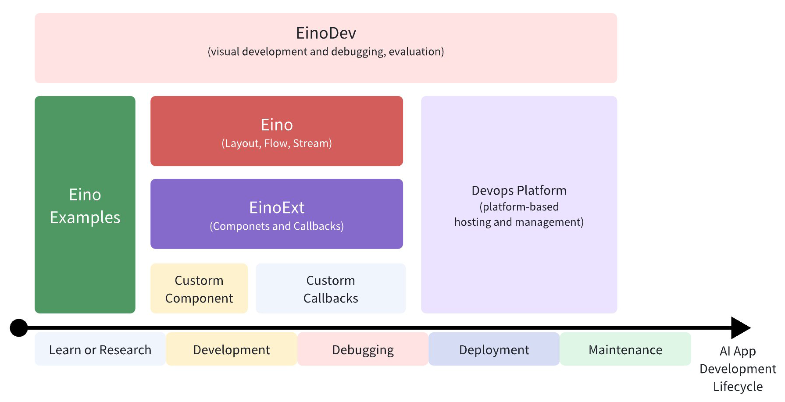
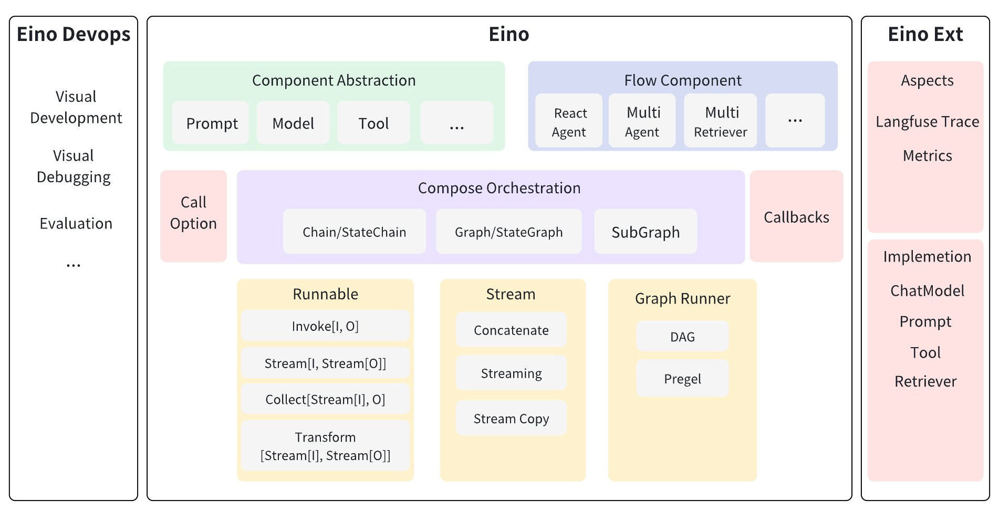
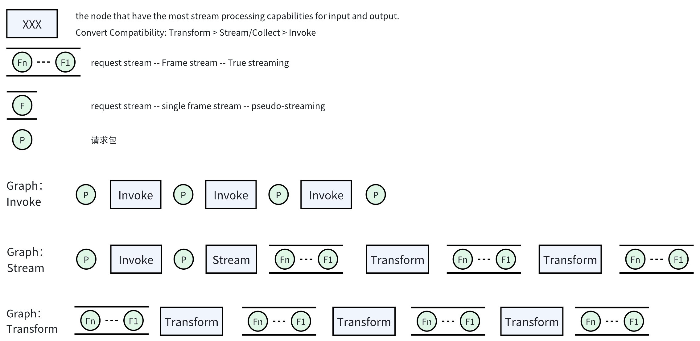
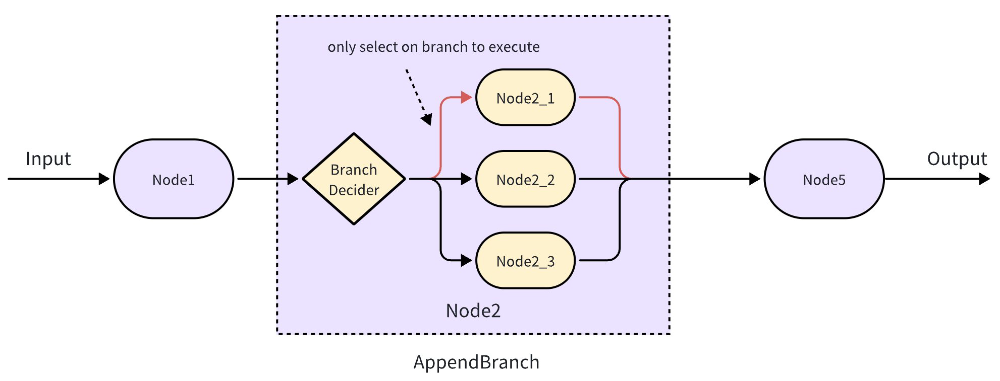
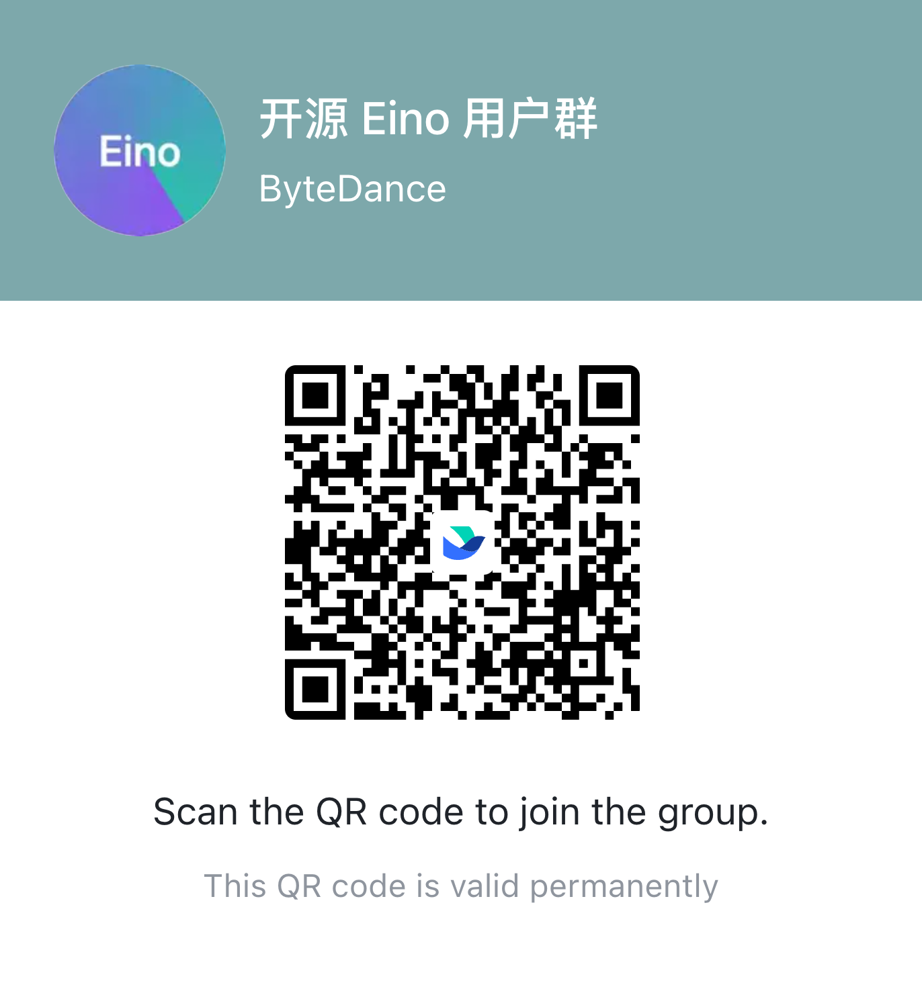

# Eino


[](https://github.com/cloudwego/eino/releases)
[](https://www.cloudwego.io/)
[](https://github.com/cloudwego/eino/blob/main/LICENSE)
[](https://goreportcard.com/report/github.com/cloudwego/eino)
[](https://github.com/cloudwego/kitex/eino)
[](https://github.com/cloudwego/eino/issues?q=is%3Aissue+is%3Aclosed)


English | [中文](README.zh_CN.md)

# Overview

**Eino['aino]** (sounds like "i know", aspiring applications to achieve the vision of "i know") aims to provide an AI application development framework in Golang. Eino draws inspiration from many excellent AI application development frameworks in the open-source community, such as LangChain, LangGraph, LlamaIndex, etc., offering an AI application development framework that better aligns with Golang programming conventions.

Eino provides rich atomic components, integrated components, component orchestration, and aspect extension capabilities to help developers build AI applications with clear architecture, easy maintenance, and high availability in a simpler and more efficient way.

Eino can standardize, simplify, and improve efficiency at different stages of the AI application development cycle:



# Key Features

## Rich Components

- Abstract commonly used capabilities across multiple scenarios into independent, orchestratable components that are ready to use out of the box
    - Such as atomic components like ChatModel, PromptTemplate, Retriever, Loader, etc.
    - Each Component type has an interface abstraction and multiple corresponding implementations
        - When orchestrating, the input and output of corresponding nodes remain consistent with the interface abstraction

- Components can be further divided into: atomic components with indivisible functionality and integrated components composed of one or more components in certain patterns
    - Integrated components: React Agent, MultiQueryRetriver, Host MultiAgent, etc.

## Easy-to-use Graph Orchestration (Graph/Chain)

- Use component instances as graph nodes, connect them with graph vertices and edges, execute nodes and transmit data flow according to edge directions, orchestrating and executing AI application logic through graphs.
- Graph orchestration can greatly simplify the development of **parallel and streaming (asynchronous)** logic while optimizing its code structure


> Using "data processing factory" as a metaphor for application construction. Graph orchestration defines applications as: a network of independent "black boxes (nodes)" that communicate through data packets over predefined connections. These "black boxes" can be connected in different scenarios to form different applications without internal changes. Here, a "black box" represents a Component, thus Graph orchestration has Component-oriented characteristics.

**Graph orchestration** provides a concise "drawing" design semantic. By adding **nodes (computation logic)** and **edges (data flow)**, developers can "draw" basic components provided in Component into drafts through visualization, which can then be reused as needed or compiled into an LLM application. In short:

> Nodes do the work, Edges tell what to do next.

The elements and concepts involved in **graph orchestration** can be summarized in four words: nodes, edges, surfaces, and aspects.

Graph orchestration in Eino is represented as: Graph, Chain

## Complete Stream Processing

In scenarios like LLM-built long-running applications, **stream processing** is crucial for making end users feel that the system is responding in real-time.

Based on whether **input and output are streaming**, there are 4 interaction modes. Different components can only provide one or more of these 4 interaction modes (most have Invoke capability, some have Stream capability, very few have Transform capability). How to connect components with different interaction modes through graph orchestration and transfer data flow is an unavoidable challenge for users.

Graph orchestration can automatically convert between streaming and non-streaming based on whether the upstream and downstream nodes' input and output are streams, making it much easier for developers to provide stream processing capabilities for AI applications without concerning about matching stream processing relationships between upstream and downstream nodes.

## Highly Extensible Aspects (Callbacks)

Like LangChain, Eino provides a complete callback system that allows developers to embed their own hooks at various stages of AI applications. This makes it convenient for developers to extend functionalities like logging, monitoring, and stream processing using these hooks.

Developers can subscribe to events at various stages of AI application building and runtime by implementing hook objects like callbacks.Handler and compose.GraphCompileCallback.

From the perspective of graph orchestration, Eino provides mechanisms for injecting and running aspects before and after the execution of graphs and nodes. Developers can flexibly design and inject their own aspect capabilities without interfering with the main process, such as Trace, instrumentation, logging, etc.

# Eino Framework Structure



The Eino framework consists of three parts:

- Eino(Eino Core): Contains Eino's component abstractions, orchestration capabilities like Graph and Chain, aspect mechanisms, etc.
- EinoExt: Component implementations, common aspect implementations, component usage examples, and various Eino extension capabilities
- Eino DevOps: Development, debugging, evaluation visualization and management capabilities for Eino

Six core concepts in Eino Core:

- Components Abstraction
    - Each Component type has a corresponding interface abstraction and multiple implementations. Can be used directly or orchestrated
        - When orchestrating, the input and output of corresponding nodes remain consistent with the interface abstraction
    - Out-of-the-box atomic components like ChatModel, PromptTemplate, Retriever, Indexer, etc.
    - The Component concept in Eino is relatively flexible - anything that satisfies one of the following responsibilities can be called a Component:
        - Can be added to Graph Node as an orchestration object
        - Serves as a dependency injection component for other orchestration objects

- Flow Integrated Components
    - Provides pre-orchestrated integrated component capabilities for common application scenarios based on the framework's Components and Graph
    - May provide capability to be orchestrated again
    - Examples: Agent, MultiAgent, Multi Retriever etc.

- Runnable -- Low User Awareness
    - Orchestration objects and products in the orchestration framework
    - All Components need to be converted to Runnable objects when being orchestrated, generally invisible to users
    - When a graph is compiled into an executable object, it is essentially a Runnable object

- Compose Orchestration
    - Connect various Component instances as Node nodes with graph vertices and edges relationships, transmit data flow according to directed edges, and execute at different nodes
    - Supports multiple orchestration forms like Graph, Chain, Workflow, etc., all essentially expressing data flow transmission and node execution order through directed graphs

- Aspect Capabilities
    - Aspect capabilities provided before and after each node execution in Graph
    - Examples: Trace, instrumentation, logging, etc.

- Stream
    - Component instances added to Node may have streaming or non-streaming input/output. Compose orchestration can connect these different forms of input/output, transmit data flow and execute nodes. This capability is called streaming orchestration capability
    - Examples: ChatModel output, ASR input/output are streaming

## Component

For specific responsibilities of each Component type, please check the corresponding interface definitions

> The following is an example illustration, not complete, please refer to the [code repository](https://github.com/cloudwego/eino-ext/tree/main/components) for accuracy

```
eino/components // 组件根目录
├── document
│   ├── interface.go 
│   └── option.go
├── embedding
│   ├── callback_extra.go
│   ├── interface.go // 一个组件的抽象
│   ├── ark          // 与抽象同级的一个文件夹代表一种具体实现
│   ├── openai
│   └── option.go
├── indexer
│   ├── callback_extra.go
│   ├── interface.go
│   ├── option.go
│   └── volc_vikingdb
├── model
│   ├── callback_extra.go
│   ├── interface.go
│   ├── ark
│   ├── openai
│   └── option.go
├── prompt
│   ├── callback_extra.go
│   ├── chat_template.go
│   ├── chat_template_test.go
│   └── interface.go
├── retriever
│   ├── callback_extra.go
│   ├── interface.go
│   ├── option.go
│   └── volc_vikingdb
├── tool
│   ├── duckduckgo
│   ├── interface.go
│   └── option.go
├── types.go
```

## Runnable


```go
type Runnable[I, O any] interface {
    Invoke(ctx context.Context, input I, opts ...Option) (output O, err error)
    Stream(ctx context.Context, input I, opts ...Option) (output *schema.StreamReader[O], err error)
    Collect(ctx context.Context, input *schema.StreamReader[I], opts ...Option) (output O, err error)
    Transform(ctx context.Context, input *schema.StreamReader[I], opts ...Option) (output *schema.StreamReader[O], err error)
}
```

- Runnable abstraction divides into 4 Lambda operators based on whether input/output is streaming
- In Compose orchestration, component instances added to Node are uniformly converted to the above Runnable abstraction
- When a Component is converted to Runnable, based on any Lambda operator it provides, combined with Streaming and Concat capabilities, the remaining unprovided Lambda operators are completed

    - Conversion between streaming and non-streaming:
      > Using StreamReader[T] and T to represent streaming and non-streaming respectively
      - Concat
          - Receive and merge T-Frames in StreamReader[T] into a complete T
      - Streaming
          - Convert T into a StreamReader[T] with only one T-Frame for streaming transmission
- Based on these two conversion relationships, Eino can encapsulate any interface with N(N<=4) interaction modes provided by users into a complete Runnable[I, O]

<table>
<tr>
<td>Source\Target<br/></td><td>Invoke[I, O any]()<br/></td><td>Stream[I, O any]()<br/></td><td>Collect[I, O any]()<br/></td><td>Transform[I, O any]()<br/></td></tr>
<tr>
<td>Invoke[I, O any]()<br/></td><td>-<br/></td><td>- Invoke input passes through<br/>- Invoke response converts to single frame stream<br/></td><td>- Invoke input converts to single frame stream<br/>- Invoke response passes through<br/></td><td>- Invoke input converts to single frame stream<br/>- Invoke response converts to single frame stream<br/></td></tr>
<tr>
<td>Stream[I, O any]()<br/></td><td>- Stream input passes through<br/>- Stream output Concat then passes through<br/></td><td>-<br/></td><td>- Stream input converts to single frame stream<br/>- Stream output Concat then passes through<br/></td><td>- Stream input converts to single frame stream<br/>- Stream output passes through<br/></td></tr>
<tr>
<td>Collect[I, O any]()<br/></td><td>- Collect input Concat then passes through<br/>- Collect output passes through<br/></td><td>- Collect input Concat then passes through<br/>- Collect output converts to single frame stream<br/></td><td>-<br/></td><td>- Collect input passes through<br/>- Collect output converts to single frame stream<br/><br/></td></tr>
<tr>
<td>Transform[I, O any]()<br/></td><td>- Transform input Concat then passes through<br/>- Transform output Concat then passes through<br/></td><td>- Transform input Concat then passes through<br/>- Transform output passes through<br/></td><td>- Transform input passes through<br/>- Transform output Concat then passes through<br/></td><td>-<br/></td></tr>
</table>

- The actual streaming capability in the programming product depends on the following orchestration paradigm



## Stream

Notice: Stream processing logic is quite complex in scenarios like **production**, **consumption**, **copying**, **merging**, and **transformation**. Any oversight in implementation can lead to issues like producer/consumer deadlock, goroutine leaks or overflow, memory leaks or overflow, high CPU load, etc. To reduce stability issues, Eino strictly requires using Eino-provided Stream implementations, thus implementing Stream as a Struct rather than an interface.

Complex stream operation scenarios:

- Conversion between streaming and non-streaming interfaces
    - When converting stream to non-stream, all data frames in the stream need to be Concat into a complete data structure
    - When converting non-stream to stream, a data structure needs to be converted into a stream with only one data frame
- The same data stream may need to be read and consumed multiple times, like by multiple aspects. Since a stream can only be read once completely, it needs to be Copied based on the number of consumers
    - When copying streams, need to consider consumption coordination and Close coordination among multiple streams. Any stream not properly Closed may prevent resources from being properly released
- Merging multiple streams into one

To make Stream API interfaces clearer and easier to use, they are aligned with Golang's built-in io.Pipe() method definition.

- API interface defined as: `schema.Pipe[T any](cap int) (*StreamReader[T], *StreamWriter[T])`
    - cap indicates Stream buffer size - how many Chunks Sender can send without blocking when there's no consumption
    - `StreamWriter` similar to PipeWriter in io.Pipe
    - `StreamReader` similar to PipeReader in io.Pipe, but with an additional `Copy(n int) []*StreamReader[T]` method
- **WARN**: Don't forget to Close() whenever you see `*StreamReader[T]` or `*StreamWriter[T]`, otherwise streams may not be properly released. Stream production and consumption are usually in separate goroutines, which could lead to goroutine leaks.

For Stream API design, see source code link: [eino/schema/stream.go](https://github.com/cloudwego/eino/blob/main/schema/stream.go)

## Compose Orchestration

### Graph

#### Nodes

- Adding a Component instance to a Graph forms a Node
- Components can be used independently or orchestrated in a Graph
- Add{Component}Node() interface listing. Only a few interfaces are listed here, for a more detailed interface list, please check the latest Eino SDK

    - For common component types, a standard behavioral semantic is abstracted and different implementations are provided
    - Users can add any custom function as a node using AddLambdaNode

```go
// AddChatModelNode add node that implements model.ChatModel.
func (g *graph) AddChatModelNode(key string, node model.ChatModel, opts ...GraphAddNodeOpt) error {
    return g.addNode(key, toChatModelNode(key, node, opts...))
}

// AddChatTemplateNode add node that implements prompt.ChatTemplate.
func (g *graph) AddChatTemplateNode(key string, node prompt.ChatTemplate, opts ...GraphAddNodeOpt) error {
    return g.addNode(key, toChatTemplateNode(key, node, opts...))
}

func (g *graph) AddToolsNode(key string, node *ToolsNode, opts ...GraphAddNodeOpt) error {
    return g.addNode(key, toToolsNode(key, node, opts...))
}

// AddLambdaNode add node that implements at least one of Invoke[I, O], Stream[I, O], Collect[I, O], Transform[I, O].
// due to the lack of supporting method generics, we need to use function generics to generate Lambda run as Runnable[I, O].
// for Invoke[I, O], use compose.InvokableLambda()
// for Stream[I, O], use compose.StreamableLambda()
// for Collect[I, O], use compose.CollectableLambda()
// for Transform[I, O], use compose.TransformableLambda()
// for arbitrary combinations of 4 kinds of lambda, use compose.AnyLambda()
func (g *graph) AddLambdaNode(key string, node *Lambda, opts ...GraphAddNodeOpt) error {
    return g.addNode(key, toLambdaNode(key, node, opts...))
}

// AddGraphNode add one kind of Graph[I, O]、Chain[I, O]、StateChain[I, O, S] as a node.
// for Graph[I, O], comes from NewGraph[I, O]()
// for Chain[I, O], comes from NewChain[I, O]()
// for StateGraph[I, O, S], comes from NewStateGraph[I, O, S]()
func (g *graph) AddGraphNode(key string, node AnyGraph, opts ...GraphAddNodeOpt) error {
    return g.addNode(key, toAnyGraphNode(key, node, opts...))
}

func (g *graph) AddRetrieverNode(key string, node retriever.Retriever, opts ...GraphAddNodeOpt) error {
    return g.addNode(key, toRetrieverNode(key, node, opts...))
}
```

#### Edges

Eino provides multiple ways to add edges

##### Add**Edge**

```go
// AddEdge adds an edge to the graph, edge means a data flow from startNode to endNode.
// the previous node's output type must be set to the next node's input type.
// NOTE: startNode and endNode must have been added to the graph before adding edge.
// e.g.
//
//  graph.AddNode("start_node_key", compose.NewPassthroughNode())
//  graph.AddNode("end_node_key", compose.NewPassthroughNode())
//
//  err := graph.AddEdge("start_node_key", "end_node_key")
func (g *graph) AddEdge(startNode, endNode string) (err error) {}
```

- Adds a directed data transmission link between two nodes to control data flow direction and node execution order


##### **AddBranch**

```go
// AddBranch adds a branch to the graph.
// e.g.
//
//  condition := func(ctx context.Context, in string) (string, error) {
//     return "next_node_key", nil
//  }
//  endNodes := map[string]bool{"path01": true, "path02": true}
//  branch := compose.NewGraphBranch(condition, endNodes)
//
//  graph.AddBranch("start_node_key", branch)
func (g *graph) AddBranch(startNode string, branch *GraphBranch) (err error) {}
```

- Based on the provided custom selection function, at runtime it selects a matching Node to execute from multiple Nodes according to computed conditions


##### **Parallel**

- Connect multiple Nodes in parallel to form concurrent execution of multiple nodes
- No AddParallel method, parallel topology paths are created through AddEdge to form **Parallel**


#### Surface (Graph)

- Create graph instance through NewGraph, and draw nodes and edges through graph.AddXXXNode, graph.AddEdge, graph.AddBranch to form a compilable and executable graph

```go
// Stateless Graph orchestration
g := NewGraph[map[string]any, *schema.Message]()

type testState struct {
    ms []string
}

genFn := func(ctx context.Context) *testState {
    return &testState{}
}

// Stateful Graph orchestration
sg := NewGraph[string, string](WithGenLocalState(genFn))

// Chain based on simplified Graph orchestration
chain := NewChain[map[string]any, string]()
```

### Chain

> Chain - A simplified Graph that connects different types of Nodes in sequence to form head-to-tail data flow transmission and sequential execution.

#### **AppendXXX**

> XXX can be ChatModel, Prompt, Indexer, Retriever, Graph and other component types
> 
> Chain is a simplified Graph, so Chain and Graph can be nested through AppendGraph

- Connect multiple Nodes head-to-tail in the order they are added, with data passing and execution occurring sequentially through the connected Nodes


#### **AppendParallel**

> Add a node that has multiple concurrently executing child nodes

```go
// Parallel run multiple nodes in parallel
//
// use `NewParallel()` to create a new parallel type
// Example:

parallel := NewParallel()
parallel.AddChatModel("output_key01", chat01)
parallel.AddChatModel("output_key01", chat02)

chain := NewChain[any,any]()
chain.AppendParallel(parallel)
```

- Create a Parallel to contain multiple concurrently executing child nodes


#### **AppendBranch**

> Add a node that selects one node to execute from multiple child nodes through a condition calculation method

```go
// NewChainBranch creates a new ChainBranch instance based on a given condition.
// It takes a generic type T and a GraphBranchCondition function for that type.
// The returned ChainBranch will have an empty key2BranchNode map and a condition function
// that wraps the provided cond to handle type assertions and error checking.
// eg.

condition := func(ctx context.Context, in string, opts ...any) (endNode string, err error) {
    // logic to determine the next node
    return "some_next_node_key", nil
}

cb := NewChainBranch[string](condition)
cb.AddPassthrough("next_node_key_01", xxx) // node in branch, represent one path of branch
cb.AddPassthrough("next_node_key_02", xxx) // node in branch

chain := NewChain[string, string]()
chain.AppendBranch(cb)
```



## Aspects (Callbacks)

- Component (including Lambda) and Graph orchestration together solve the problem of "defining business logic". For cross-cutting functionalities like logging, tracing, metrics, screen display, etc., there needs to be a mechanism to inject these functionalities into Components (including Lambda) and Graph.

- Additionally, users may want to access intermediate information during the execution of specific Component implementations, such as VikingDBRetriever providing additional DB Name information, or ArkChatModel providing request temperature parameters. A mechanism is needed to expose these intermediate states.

- Callbacks support both "**cross-cutting functionality injection**" and "**intermediate state exposure**" by having users provide and register "functions" (Callback Handlers) that Components and Graph call back at fixed "timings" (or aspects, points) to provide corresponding information.

- In Eino, **entities** like Components and Graph call back user-provided **functions** (Callback Handlers) at fixed **timings** (Callback Timing), passing information about **who they are** (RunInfo) and **what happened** (Callback Input & Output).

## Detailed Documentation

// TODO: Link to user manual and other documentation

## Related Projects

- [EinoExt](https://github.com/cloudwego/eino-ext): Component implementations, common aspect implementations, component usage examples, and various Eino extension capabilities.
- [EinoExamples](https://github.com/cloudwego/eino-examples): Demos of orchestration capabilities and scenario-based AI applications using Eino.

## Security

If you discover a potential security issue in this project, or think you may
have discovered a security issue, we ask that you notify Bytedance Security via our [security center](https://security.bytedance.com/src) or [vulnerability reporting email](sec@bytedance.com).

Please do **not** create a public GitHub issue.

## Contact US
- How to become a member: [COMMUNITY MEMBERSHIP](https://github.com/cloudwego/community/blob/main/COMMUNITY_MEMBERSHIP.md)
- Issues: [Issues](https://github.com/cloudwego/eino/issues)
- Lark: Scan the QR code below with [Register Feishu](https://www.feishu.cn/en/) to join our CloudWeGo/kitex user group.

  

## License

This project is licensed under the [Apache-2.0 License](LICENSE.txt).